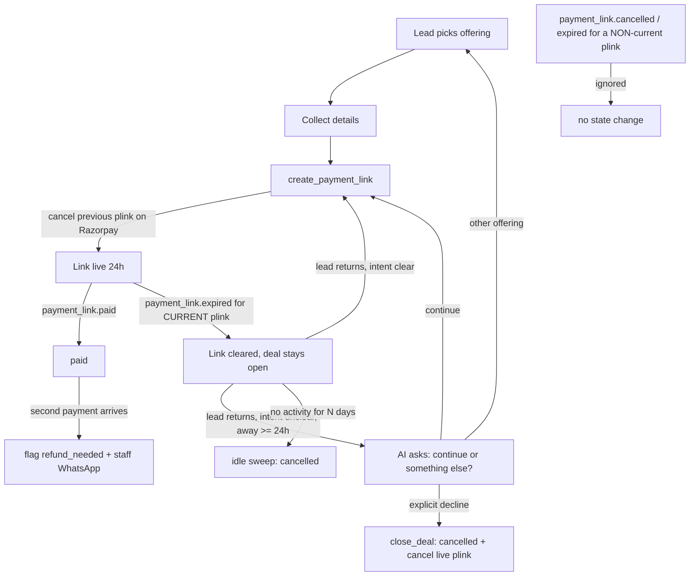

# Deal lifecycle: links expire, deals don't — Blueprint

Status: design locked 2026-09-30 (grill-me, 8 decisions). Not built. Ship order R1 → R4, each pushed only on the user's say-so.

Trigger: lead Vivek (session 7091a634, tenant eba3ed94) was re-sent a dead ₹49 link after the price moved to ₹1.
Fixed on 2026-09-29 (commit d35cb7df, link_is_live). He got a new ₹1 link on 2026-09-30, confirmed live. The research that
followed found the deeper problems below.

---

## Part 1 — Design Blueprint

### 1.1 Problem (evidence, all checked live on 2026-09-30)

| # | Problem | Evidence |
|---|---|---|
| P1 | The scheduler skips most timed jobs. APScheduler's default misfire_grace_time is 1 s; our jobs start 1.3–2 s late. | scheduler_runs, last 30 days: intake-staleness-sweep 6 ran / 8,514 missed; crm-cutoff-sweep, ad-insights-sync, number-quality-sync 0 ran; pending-whatsapp-alerts 95% missed. `AsyncIOScheduler()` at backend/app/main.py:361 sets no job_defaults. |
| P2 | Unpaid deals get stuck. | 5ea5c658 offer_pending since 2026-08-12 (the sweep doesn't cover that status); 4e2df4a9 awaiting_payment ₹49 since 2026-09-28. |
| P3 | The sweep measures from deal creation, not activity. | intake_sessions.updated_at is never written (no trigger, no code write). |
| P4 | Old links stay payable; a double payment is silent. | No Razorpay cancel call anywhere; razorpay_payment_link_id is not stored on intake_sessions; the second payment is dropped with no log (intake.py confirm_intake_payment, ~1412). |
| P5 | The Deals-board send-link repeats the dead-link bug. | deals.py:309 send_payment_link uses a fixed idempotency key and sets link_expires_at = now+24h (:344, :510). deal_actions._send_quote resends without an expiry check. |
| P6 | A link expiring kills the whole deal. | routes/intake.py:266 → expire_intake_session cancels. routes/intake.py:383 maps expired **and cancelled** to mark_lost. |
| P7 | The AI can't close a deal, and "returning" is keyword-only. | No close tool in deal_engine's tool list. ai_reply.py:1647 detects a return only from a greeting or a blank message. |

### 1.2 Locked decisions

| # | Decision | Choice |
|---|---|---|
| D1 | Deals nobody returns to | An idle-close clock. Per tenant, in the operator console, 2–90 days, default 30. |
| D2 | When a 24h link expires | Only the link dies; the deal stays open. |
| D3 | What resets the idle clock | New last_activity_at. Reset only by a lead message or real deal progress (package picked, details saved, link created, paid). Our outbound messages and link expiry don't count. |
| D4 | When to ask "continue or something else?" | Only if the lead was away ≥ 24h AND the message doesn't already show intent. The LLM judges meaning, no keyword lists. If unsure, ask. close_deal needs an explicit decline. |
| D5 | Ship bar for the AI change | Eval on each live tenant's own reply model: 0 wrong closes, 0 dead/old-price links, ≥ 90% right actions. |
| D6 | Details on "start fresh" | Show the old details and have the lead confirm or correct them in one message. Never reuse silently (a booking may be for someone else). |
| D7 | Double payment | Prevent it (cancel the old link on replace/close). Catch it (record, flag "refund needed", WhatsApp staff). A human refunds; no auto-refund. |
| D8 | Rollout | R1 scheduler → R2 money safety → R3 lifecycle + AI → R4 visibility. |

### 1.3 Non-goals (this iteration)
- No auto-refunds (D7).
- No deal-aware silence nudge ("your link expired, want a new one?"). That's v2.
- No template messages sent when a link expires; we still send nothing (templates cost money).
- No rework of the root cause of scheduler lateness (sync Supabase calls on the event loop). R1 fixes the symptom safely; the event-loop work is separate.
- The paid → resolved 48h auto-resolve is unchanged.

### 1.4 Worked example — Vivek under the new design (astro tenant, idle limit 30 days)

```
Sep 29 12:27  picks One Question ₹1, gives 5 details, link #1 (valid 24h)   last_activity_at = Sep 29
Sep 30 12:27  link #1 expires → link cleared, deal STAYS awaiting_payment, card tag "link expired"
Oct 3  18:00  "hi sir" (away 4 days, unclear) → "Welcome back! Continue with One Question (₹1),
              or look at something else?"                                   last_activity_at = Oct 3
Oct 3  18:02  "continue" → link #2 created, text says "valid till Oct 4, 6:02 PM"
Oct 4  09:00  pays #2 → paid. (If he had also paid a stale #1: it was cancelled on Razorpay;
              if a payment still slipped in → "refund needed" flag + staff WhatsApp.)
— or —
Oct 3  18:00  "venam bro" → close_deal → cancelled, any live link cancelled on Razorpay
— or —
never returns → idle sweep closes the deal on Nov 2 (30 days after Oct 3)
```

Returning repeat customer (D6): on Oct 10 he writes "vera oru question kekanum" → "Same details as before: Vivek, 12 Mar 1995,
Madurai, 6:30 AM? Just send your new question." → "it's for my amma" → the AI asks for her details.

### 1.5 Flow



### 1.6 Data model (migration 212)

```sql
ALTER TABLE intake_sessions
  ADD COLUMN IF NOT EXISTS last_activity_at timestamptz,
  ADD COLUMN IF NOT EXISTS razorpay_payment_link_id text,
  ADD COLUMN IF NOT EXISTS refund_needed boolean NOT NULL DEFAULT false,
  ADD COLUMN IF NOT EXISTS extra_payment_ids text[] NOT NULL DEFAULT '{}';
UPDATE intake_sessions SET last_activity_at = created_at WHERE last_activity_at IS NULL;
-- R3: one open deal per lead (checked 2026-09-30: 0 leads have >1 open row)
CREATE UNIQUE INDEX IF NOT EXISTS uq_intake_one_open_per_lead ON intake_sessions (tenant_id, lead_id)
  WHERE status NOT IN ('paid','cancelled','resolved');
```
deals already has razorpay_payment_link_id (204_deals.sql:41), but nothing reads it yet.
Setting: app_settings key `deal_idle_close_days` (per tenant, int, clamp 2–90, default 30).

### 1.7 Edge cases

| Case | Handling |
|---|---|
| We cancel an old link and Razorpay sends payment_link.cancelled | Ignore unless the plink id equals the deal's CURRENT one. Fixes routes/intake.py:383 marking live deals lost. |
| expired webhook for an old (replaced) link | Same rule: only the current plink clears state. |
| Razorpay cancel API fails or times out | Log it and continue. The link dies within 24h anyway; D7 detection covers the gap. |
| Cancel on an already-paid link | Razorpay errors; treat it as "already paid" and let the paid webhook win. |
| Lead messages at the moment the idle sweep runs | The sweep update is conditional (`last_activity_at < cutoff AND status = …`), so the fresh touch wins. |
| Payment lands on a cancelled/closed deal | confirm_intake_payment's `.neq(status,'paid')` still confirms it. A real sale, surfaced to staff (unchanged). |
| Second payment on a paid deal | Append to extra_payment_ids, set refund_needed, notify_pool + staff WhatsApp, log a warning. |
| Tenant changes the idle days | Applies at the next sweep; the value is clamped; a missing value means 30. |
| Price changed while the deal was idle | Already handled: link_is_live compares the current tenant price. |
| Offering deleted while the deal was idle | Already handled: DEAL STATE says "not available; help them choose". |
| AI unsure whether it's a decline ("later", "yosichu solren") | Not a decline. The deal stays open (D4); the eval checks for 0 wrong closes. |
| Lead books for another person | D6 confirm step; details are never silently reused. |
| Start fresh while an old deal is open | Close the old deal (and its plink) before opening the new one; the unique index enforces it. |
| WhatsApp 24h window | The AI replies only to an inbound message, so the window is always open; no template is needed. |

---

## Part 2 — Implementation Plan

Rules for every release: TDD (a test fails first), `cd backend && .venv/bin/python -m pytest` green, /gstack-review on the diff,
/gstack-cso for R2 (payments/webhooks), push only on the user's say-so, check it live afterwards.

### R1 — Scheduler actually runs its jobs
1. Read what crm-cutoff-sweep, ad-insights-sync and number-quality-sync do. For each, what would its first run in 30+ days act on? Report before turning them on.
2. [backend/app/main.py](../../backend/app/main.py) :361: `AsyncIOScheduler(job_defaults={"misfire_grace_time": 60, "coalesce": True, "max_instances": 1})`.
3. A health guard so this can't hide again: flag any job with 0 successes in 3× its interval (operator Scheduler Health view / daily digest). Pick the surface in R1.
4. One-time cleanup, with the user's OK per row: 5ea5c658 (offer_pending since Aug 12), 4e2df4a9 (₹49, Sep 28).

Verify: a unit test asserts the job_defaults. After deploy, a scheduler_runs query shows missed ≈ 0 and intake-staleness-sweep succeeding every 5 min for 1 hour.

### R2 — Money safety + one link rule
1. [payment_razorpay.py](../../backend/app/services/payment_razorpay.py): add `cancel_payment_link(plink_id, tenant_id)`.
2. Store razorpay_payment_link_id wherever a link is created: [deal_actions.py](../../backend/app/services/deal_actions.py) `_create_payment_link`, the legacy writer in [intake.py](../../backend/app/services/intake.py), and deals.
3. Cancel the previous plink on regenerate, on select_offering re-point, and on close.
4. [routes/intake.py](../../backend/app/routes/intake.py): ignore cancelled/expired events for a non-current plink (fixes :383); record a double payment in `confirm_intake_payment`.
5. [deals.py](../../backend/app/services/deals.py) `send_payment_link` / `sync_intake_session` and `deal_actions._send_quote`: use the shared liveness rule; store the real expiry, not now+24h; the idempotency key includes a version like the intake one.

Verify: tests for each cancel trigger, for the non-current webhook being ignored, and for the double-payment flag and alert. Mutation check: each test fails without its guard.

### R3 — Deal lifecycle + AI on return (eval-gated)
1. Migration 212 (§1.6). The unique index goes last, after the start-fresh close path exists.
2. Touch last_activity_at on inbound (the ai_reply active-session fetch) and in `intake._update_session` for progress writes only.
3. `expire_intake_session`: clear the link, keep the deal open (D2). Deals-board card stays "awaiting_payment" with a "link expired" tag.
4. `sweep_stale_intake_sessions`: per-tenant `deal_idle_close_days`, by last_activity_at, covering every unfinished status including offer_pending.
5. [deal_engine.py](../../backend/app/services/deal_engine.py): DEAL STATE gains "last message from them: N days ago" and the link expiry time; replace the keyword-only `returning` with the D4 rule; add the `close_deal` tool (explicit decline only) and the D6 confirm-details instruction.
6. Operator console: [routes/operator.py](../../backend/app/routes/operator.py) GET map + PATCH validation (2–90), and [config.tsx](../../frontend/app/operator/(console)/client/[id]/views/config.tsx) number input.
7. Eval: `backend/evals/conversations/scenarios_returning.json`, 50+ returning-lead messages (half from real chats, anonymised; Tamil/Tanglish/English), with hard checks (close_deal called? link live and at the current price?) and judge checks. Run it on every live tenant's model. **Doesn't ship until D5 passes.**

Verify: pytest, the eval report with numbers per model, typecheck + lint for the console.

### R4 — Staff visibility
[BoardTab.tsx](../../frontend/app/dashboard/deals/BoardTab.tsx): "idle N days", "link expired", "refund needed" tags.
Verify: typecheck + lint + a screenshot of the board with each tag.

### Open follow-ups (not in scope)
- Tenant eba3ed94's intake field label "Place of Birh" (typo). The operator fixes it in the Services page.
- Root cause of scheduler lateness (sync DB calls on the event loop).
- Why the payment_link.expired webhook never cleared Vivek's original session (likely created before links had expire_by; unverified).
