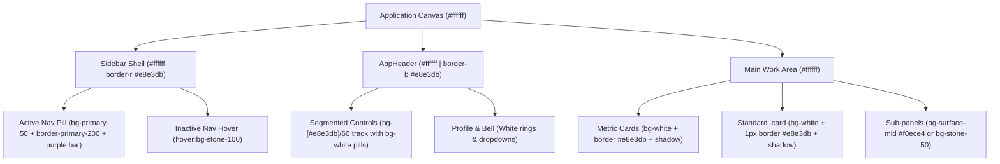

# Design Blueprint: White Background Redesign

**Feature**: Global White Background & Surface Elevation Refinement  
**Status**: APPROVED (via /grill-me Socratic Alignment)  
**Date**: 2026-10-07  
**Corpus**: ChillandBuild/Aira-AI  

---

## 1. Problem Statement & Objectives

The application currently renders on a warm off-white / almond canvas (`#faf8f5`) with white card panels (`#ffffff`). While warm and distinctive, the user requested transitioning the canvas to crisp, pure white (`#ffffff`).

Transitioning the canvas to white creates an immediate contrast challenge:
1. White cards on a white background lose all boundary definition if unbordered.
2. The sidebar active tab previously relied on a white card (`bg-white`) against the cream sidebar (`#faf8f5`), which becomes completely invisible against a white sidebar.
3. Top headers, auth wrappers, and fallbacks hardcoded to `#faf8f5` would appear mismatched.

The objective is to execute a clean, seamless transition to pure white across the application shell while establishing crisp surface boundaries, tactile hover states, and clear active navigation indicators.

---

## 2. Locked Scope & Non-Goals

### In-Scope
- **Design Tokens**: Update `--bg: #ffffff;` and `--surface-low: #ffffff;` in `globals.css`, and `background: "#ffffff"` in `tailwind.config.ts`.
- **Card Surfaces**: Ensure `.card` in `globals.css` possesses an explicit 1px subtle border (`border: 1px solid var(--border);`) alongside its soft elevation shadow.
- **Sidebar Navigation**:
  - Change sidebar canvas to pure white (`bg-background` -> `#ffffff`).
  - Active nav pills change from `bg-white` to a subtle brand-tinted pill (`bg-primary-50 border-primary-200/80 text-primary-800`), retaining the brand gradient indicator bar.
  - Inactive nav item hover changes from `hover:bg-[#f0ece4]` to clean neutral grey (`hover:bg-stone-100 text-ink`).
- **Application Shell & Headers**:
  - Update `AppHeader.tsx` header background from `bg-[#faf8f5]` to `bg-background` (`#ffffff`).
  - Update `ClientLayout.tsx` Suspense fallback and inbox wrapper to white.
  - Update Operator console client view header to white.
  - Update Auth screens (`app/(auth)/layout.tsx`, `app/(auth)/login/page.tsx`) from `#faf8f5` to white.
- **PWA Manifest & Badges**:
  - Update `manifest.webmanifest` background color from `#faf8f5` to `#ffffff`.
  - Update NotificationBell avatar ring from `ring-[#faf8f5]` to `ring-white`.

### Non-Goals (Explicitly Out of Scope)
- No changes to backend APIs, database schemas, or RLS policies.
- No alteration to the primary brand violet hue (`#5b21b6`).
- No changes to dark-mode tokens or third-party integrations (WhatsApp, TeleCMI).

---

## 3. Surface & Hierarchy Architecture

---

## 4. Design Token Matrix

| Token | Previous Value | New Value | Semantic Role |
|---|---|---|---|
| `--bg` | `#faf8f5` | `#ffffff` | Global canvas & body background |
| `--surface-low` | `#faf8f5` | `#ffffff` | Low-elevation surface tone |
| `background` (Tailwind) | `#faf8f5` | `#ffffff` | `bg-background` utility class |
| `.card` border | None (shadow only) | `1px solid var(--border)` | Delineates white cards on white canvas |
| Sidebar Active Fill | `bg-white` | `bg-primary-50` | Active indicator against white sidebar |
| Sidebar Active Border | `border-[#e2dcce]` | `border-primary-200/80` | Subtle contrast edge on active pill |
| Sidebar Inactive Hover | `hover:bg-[#f0ece4]` | `hover:bg-stone-100` | Tactile neutral hover response |
| AppHeader background | `bg-[#faf8f5]` | `bg-background` (`#ffffff`) | Sticky top bar |
| Auth Screen background | `bg-[#faf8f5]` | `bg-white` (`#ffffff`) | Login & registration screens |

---

## 5. Edge Cases & Handling Strategy

1. **White Card on White Canvas**:
   - *Risk*: Cards look indistinct or blend into the page.
   - *Fix*: `.card` utility explicitly gains `border: 1px solid var(--border)` (`#e8e3db`) in addition to `var(--shadow-card)`.
2. **Active Tab vs Inactive Tabs in Sidebar**:
   - *Risk*: A white active pill on a white sidebar canvas loses contrast.
   - *Fix*: Active pill receives `bg-primary-50` and `text-primary-800` + `border-primary-200/80`, anchored by the existing purple vertical accent bar.
3. **Hardcoded `#faf8f5` Occurrences**:
   - *Risk*: Disjointed patches of warm cream in loading fallbacks or headers.
   - *Fix*: All shell components (`ClientLayout`, `AppHeader`, `NotificationBell`, `(auth)`) updated to reference token classes or `#ffffff`.

---

## 6. Step-by-Step Implementation Plan

### Phase 1: Core Design Tokens
- Modify [globals.css](file:///Users/prem/Documents/Aira%20AI/frontend/app/globals.css):
  - Change `--bg` and `--surface-low` to `#ffffff`.
  - Add `border: 1px solid var(--border);` to `.card`.
- Modify [tailwind.config.ts](file:///Users/prem/Documents/Aira%20AI/frontend/tailwind.config.ts):
  - Change `colors.background`, `surface-low`, and `surface-subtle` to `#ffffff`.
- Modify [manifest.webmanifest/route.ts](file:///Users/prem/Documents/Aira%20AI/frontend/app/manifest.webmanifest/route.ts):
  - Update `background_color` to `#ffffff`.

### Phase 2: App Shell Layouts & Headers
- Modify [ClientLayout.tsx](file:///Users/prem/Documents/Aira%20AI/frontend/app/dashboard/ClientLayout.tsx):
  - Replace hardcoded `bg-[#faf8f5]` in Suspense fallback with `bg-background` / `bg-white`.
- Modify [AppHeader.tsx](file:///Users/prem/Documents/Aira%20AI/frontend/components/AppHeader.tsx):
  - Update `<header>` background from `bg-[#faf8f5]` to `bg-background` (`#ffffff`).
- Modify [operator client page.tsx](file:///Users/prem/Documents/Aira%20AI/frontend/app/operator/(console)/client/[id]/page.tsx):
  - Update header `bg-[#faf8f5]` to `bg-background` (`#ffffff`).
- Modify [auth layout.tsx](file:///Users/prem/Documents/Aira%20AI/frontend/app/(auth)/layout.tsx) and [login page.tsx](file:///Users/prem/Documents/Aira%20AI/frontend/app/(auth)/login/page.tsx):
  - Update `bg-[#faf8f5]` to `bg-white`.

### Phase 3: Sidebar Active & Hover States
- Modify [sidebar.tsx](file:///Users/prem/Documents/Aira%20AI/frontend/components/sidebar.tsx):
  - Update active nav item styles from `bg-white border-[#e2dcce]` to `bg-primary-50 border-primary-200/80 text-primary-800`.
  - Update hover states from `hover:bg-[#f0ece4]` to `hover:bg-stone-100`.

### Phase 4: Notification Bell & Accents
- Modify [NotificationBell.tsx](file:///Users/prem/Documents/Aira%20AI/frontend/components/NotificationBell.tsx):
  - Update badge ring from `ring-[#faf8f5]` to `ring-white`.

### Phase 5: Verification & Quality Assurance
- Run frontend typecheck: `npm run typecheck` in `frontend/`.
- Run frontend build: `npm run build` in `frontend/`.
- Run frontend linter: `npm run lint` in `frontend/`.
