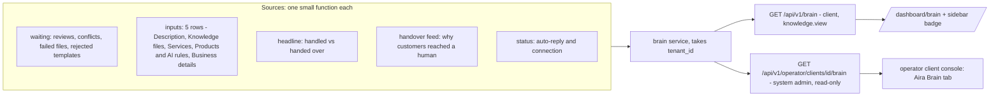

# Aira Brain: Blueprint

Status: DRAFT. Founder approved the design and the later decisions (conflicts in the hub only, 8-section Description) in chat on 2026-09-30. No code is written. Building needs a separate "go".
Supersedes nothing. The earlier plan [review-approvals-hub.md](review-approvals-hub.md) is left untouched. This blueprint widens it from an approvals page to a hub for two audiences.
Working name: "Aira Brain" (the old name "Review" collides with the existing Review buttons on Knowledge).

## 1. Problem

- Everything Aira reads about a business lives on separate pages, and nothing shows whether Aira is set up right.
- Approvals wait unseen: a sorted-file review, and conflicts between sources. Nothing reaches replies until approved, so an unseen approval means Aira silently lacks knowledge the client thinks it has.
- The operator console has no view of reviews, conflicts or setup completeness. Its Health view covers channel delivery and incidents only.
- When Aira hands a customer to a human, nothing tells the client why. Live data (25 handovers, may include test tenants): 21 were "User requested a human agent", 2 were a failed payment link, and only 2 were Aira admitting it had to check with the team. So most handovers are not knowledge gaps, and the hub must separate the two kinds.
- Demand evidence is weak and stated as such: 6 reviews ever across 2 tenants, one pending since 2026-09-24 (may be a test tenant).

Goal: one place per audience. The client sees what is waiting, what Aira was told, and what Aira could not answer. The operator sees the same per client, plus platform-level items.

## 2. Locked decisions

1. The hub shows status and approvals for every input. Editing stays on each existing page.
2. One iteration. No v1/v2 split. Build in dependency order with a checkpoint at each step, and push once, only when the founder says so.
3. Conflicts are shown in the hub only (section 9A). Knowledge, Services and Products each keep one "N things disagree, open the Hub" line (a count and a link, no panel). The panel copies are removed only after the hub is verified.
4. The operator view is read-only. The one exception is the answers-only Test Aira sandbox, which creates no lead, writes nothing and runs no tools (section 10).
5. Conflicts panel gets bulk Fix and Dismiss with a confirm sheet (section 9).
6. Each feature is placed by its client and operator rating (section 11).
7. The Description grows from 6 to 8 sections: 7th "Business hours & contact", 8th "What Aira says when it brings in your team" (the handover line). Real move, not a relabel (section 9B).
8. No per-page routing of conflicts. Each hub row names its source (Description section or knowledge file) and what it contradicts (section 9A).
9. All 8 Description sections are owner-only to edit, including the handover line.

## 3. Non-goals

- Moving the editors into the hub.
- Changing apply_review. Bulk actions get new functions and leave apply_fix untouched. The one later edit to apply_fix is deleting its handover_line branch once the handover line lives in the Description (section 9B).
- A unified approval_items table.
- Operator impersonation (the console is "visibility only").
- A sandbox that creates test leads, deals or payment links (leads has no test flag, and every analytics and scoring reader would need to exclude them).
- Storing the prompt Aira used for each reply. "What Aira saw" is a reconstruction of what it would see now.
- Rebuilding Home or Analytics stats. Reply time and lead counts stay there, and the hub links to them.
- A before/after impact card (6 reviews ever is too little data to claim it honestly) and cross-client benchmarks.

## 4. Verified facts this design rests on

| Fact | Source |
|---|---|
| Reviews live in knowledge_reviews (status pending, applied, discarded). Only index is (tenant_id, document_id, created_at DESC). | supabase/migrations/190_knowledge_auto_sort.sql:54-75 |
| One pending review per document is enforced by run_sort marking older ones discarded, not by the database. | services/knowledge_sort.py:669-676 |
| The consistency report is one JSON setting (consistency_report). Dismissed ids are stored in it. Issues are not a table. | services/consistency.py:34, 353-370, 420 |
| A cheap count reads len(visible(load_report(tid))["issues"]). current_report calls gather() and is too heavy for a poll. | services/consistency.py:353-417 |
| apply_fix can edit only: Description (owner only), handover_line, or a sorted knowledge file. It never edits Products or Services. | services/consistency.py:455-494 |
| The conflict check reads five inputs: Services config, Description, handover line, ready catalog items, indexed documents. | services/consistency.py:65-80 |
| Description is edited as 6 profile sections (about, how_to_buy, who, voice, job, never) through PUT /api/v1/ai-tune/profile. That router is owner-only. Section 9B grows it to 8. | services/business_profile.py:32-43, routes/ai_tune.py:17 |
| Handover line today saves via PATCH /api/v1/settings/ and needs settings.manage (any settings user the owner authorised). The conflict fix on it needs knowledge.manage. After section 9B it is owner-only. | routes/app_settings.py:379, routes/consistency.py:16 |
| Business hours are not a setting and the old page only redirects to the Description tab. None of the 6 sections asks for hours, so a client has no visible place for them. Section 9B adds one. | frontend/app/dashboard/settings/business-hours/page.tsx, services/business_profile.py:32-43 |
| The handover setting has three readers (ai_reply._handover_line, which also feeds deal_turn as a parameter; the Knowledge readiness route; the conflict gather) and these writers: the Knowledge page box, KnowledgeReviewModal, apply_fix, the generic settings PATCH, and Auto-Sort's suggestion. | ai_reply.py:340, routes/knowledge.py:138, consistency.py:75, knowledge/page.tsx:845, KnowledgeReviewModal.tsx:284 |
| Auto-Sort deletes any line that has a phone number next to call/contact/talk/speak/whatsapp/reach/number/meet/complaint/manager from the Description and saves it as the handover setting. The model prompt says the same. | services/knowledge_sort.py:158, 326-348, 400 |
| The client starter kit has 8 headings, including "WHEN TO HAND OVER TO A PERSON" (which situations, phone, hours). It is an uploaded document, not a Description section. | frontend/app/dashboard/knowledge/kitContent.ts:33-40, services/knowledge_kit.py:48 |
| A price conflict does not record whether it compared against a service or a product, because service and catalog prices are merged into one list. | services/consistency.py:113-119 |
| The consistency panel is on 2 pages today (Knowledge, Services) and shows all conflicts on both. A third copy on Catalog was added uncommitted on 2026-09-30, also unfiltered. | knowledge/page.tsx:893, services/page.tsx:133, catalog/page.tsx |
| catalog_items status is only draft or ready. Only ready items reach Aira and the conflict check. | migrations/136_catalog_items.sql:8, services/consistency.py:71 |
| The reply reads 8 client-editable inputs: description, handover line, knowledge files, Services config, catalog and its AI rules, business details, auto-reply switch. | services/ai_reply.py:1533-1697 |
| The master prompt is one platform-wide row (platform_defaults.default_master_prompt, 11,646 chars, updated 2026-07-19). Operator-only edit at /operator/prompt-template. | services/ai_reply.py:257-284, live DB |
| Lead score is not shown to the model. Only name and segment go into LEAD CONTEXT. | services/ai_reply.py:1576-1586 |
| Handover does not pause the AI. It adds an escalation block only. | services/ai_reply.py:1130, 1671 |
| chat_handovers stores reason, status, opened_at, but not the customer's message. | migrations/043_chat_escalation.sql, services/ai_reply.py:1139-1145 |
| Sidebar badges: Inbox uses a Supabase realtime channel. Call alerts poll every 60s. The Knowledge Base entry has no badge. MoreMenu has no badges. | components/sidebar.tsx:185-242, components/MoreMenu.tsx |
| Home already shows AI share, inbound, outbound, awaiting response, escalations. Analytics already shows median reply time. | components/dashboard/AiWorkloadSection.tsx, analytics/overviewPresentation.ts:126 |
| Tenant roles are owner or caller, plus custom roles built from permissions. "Admin" means the operator (system_admins table). | migrations/018_tenants.sql:12, dependencies/system_admin.py |
| A reminder pattern exists: cron job, per-tenant notify_user to admins, skips empty days. | main.py:335-342, 477-478, services/call_alerts.py:146-172, services/notify.py |
| There is no test chat. Only CLI harnesses under backend/scripts/sim. | repo grep |

## 5. Verification results (2026-09-30) and what each changed

Every item that was unverified in the first draft has been checked in code or the live database (counts only, no customer content).

| # | Question | Result | Design change |
|---|---|---|---|
| 1 | Quota | check_quota only blocks when hard_cap is set (entitlements.py:153-180). Live DB: no tenant has a cap on any metric (all hard_cap null, incl. 8 ai_reply rows). Over quota Aira would skip silently (ai_reply.py:1832-1834), but that state does not occur today. | The quota bar is dropped from "Aira can reply". Quota shows only if a cap is ever set. |
| 2 | Connection status | A tenant-scoped GET /api/v1/settings/webhook-health exists (needs settings.view). It gives last inbound per channel and token_alerts (token_invalid incidents in the last 48h). There is no explicit valid/expired field. The operator's "expired" is any token_invalid incident ever, so it can go stale (operator.py:1388-1396). | The brain status reuses the webhook-health logic. It shows only to users with settings.view. The operator row uses the same 48h rule, not the "ever" rule. |
| 3 | Prompt builder side effects | build_reply_system_prompt makes no LLM or embedding call. It has one conditional write: leads.tamil_locked (ai_reply.py:592-607) when reply_language_mode is tanglish_escalate_tamil. Knowledge retrieval (a Jina embedding call in semantic mode) happens in generate_reply, not in the builder. **Nothing stores the prompt Aira actually used.** | "What Aira saw" is a reconstruction ("what Aira would see now"), not a record. It passes a copy of the lead to suppress the write and skips retrieval unless the operator clicks "Show retrieved knowledge" (costs one embedding call). |
| 4 | Fallback replies | Nothing dedicated is persisted (ai_reply.py:1936, 2003-2010). Proxies: handover reasons for the exception path and the generic-fallback path. Live DB: no such reasons exist. | The fallback count uses handover reasons, with no reply-path change. Its rating drops (section 11). |
| 5 | Question join | Feasible: the latest inbound message for the lead at or before chat_handovers.opened_at. idx_messages_lead_id serves it. Bursts can make it inexact. | No schema change. The feed labels the question "likely message". |
| 6 | Test users | Playwright reads only BASE_URL. Docs name owner, custom-manage and view-only, but no script creates a view-only user and no credential source is documented. | Stays unverified. Founder to confirm (section 15). |
| 7 | Migration numbering | Numbered series is live (schema_migrations latest: 209_call_wrapup_v2_narrow). The next number is 210. | Section 9B needs one data step for the 2 tenants who have a handover line (a one-off Python script, not a SQL migration, so Description versions are written by kv.save_description). No schema change. |
| 8 | Sandbox flag | leads has no is_test or sandbox column, only source columns. A flagged test lead would need a migration and a change to every leads reader (analytics, scoring). | Sandbox redesigned as answers-only: no lead, no writes, no tools (section 10). |
| 9 | "Handled" definition | No per-chat counter exists. Existing counters are per message (analytics_daily_messages, split on messages.is_ai_generated) plus the funnel and analytics_response_times. | A new per-chat aggregation with the proposed definition in section 15. |

**Live facts that changed ratings.** chat_handovers holds 25 rows: 21 "User requested a human agent", 2 "Payment link could not be created for a package", 2 "Aira told the customer it is checking with the team". Only the last kind is a knowledge gap. Counts may include test tenants.

**Still unverified, checked while building:**
- Whether should_escalate_to_inbox always opens a handover for the fallback flags.
- Whether the AI model call in deal_turn.converse_once can run with tools disabled and without quota metering (needed by the answers-only sandbox).
- Whether human replies share the signature is_ai_generated=false with reply_source ai.
- Whether a view-only test user exists on the UI test tenant.

## 6. Architecture



Sustainability rule: a waiting source or an input is one function returning {key, label, state, detail, edit_href, permission}. Adding one is one function plus one test. The badge count and the hub total come from the same helper, so they cannot disagree.

The shared helper carries over from the earlier plan:
- read the stored report, never gather() (no model call, no heavy read);
- drop forged reviews whose document belongs to another tenant (fetch the tenant's documents by id, keep only matching reviews);
- one pending review per document, the latest by created_at;
- a missing, empty or malformed report counts as 0 issues with status 200.

## 7. Contracts

```
GET /api/v1/brain
{ "headline": { "chats": 84, "handled_by_aira": 71, "handed_over": 6, "unanswered": 7, "window_days": 7,
                "asked_for_human": 5, "knowledge_gaps": 1 },
  "waiting": { "count": 4,
    "sort_reviews": [{ "id", "document_id", "title", "created_at" }],
    "consistency_count": 2, "failed_files": [{ "id", "name" }], "rejected_templates": [] },
  "inputs": [{ "key": "description", "label": "Description (8 sections)",
               "state": "ok|missing|off|attention", "detail": "Set", "edit_href": "/dashboard/knowledge?tab=description",
               "can_edit": true, "reason": null }],
  "handovers": [{ "handover_id", "lead_id", "reason", "kind": "asked_for_human|knowledge_gap|payment|other",
                  "likely_question", "opened_at" }],
  "status": { "auto_reply": "on|off", "connection": { "state": "ok|token_problem|quiet|unknown", "channels": [] },
             "quota": null } }   // connection needs settings.view, else omitted. quota is null unless a hard cap is set.

GET /api/v1/brain/count -> { count, sort_count, consistency_count }   (sidebar poll, 60s, no model call)
POST /api/v1/consistency/fix-batch      { issue_ids[], checked_at }
POST /api/v1/consistency/dismiss-batch  { issue_ids[], checked_at }
POST /api/v1/consistency/restore        { issue_ids[] }
```

Consistency issues are not duplicated in /brain. The hub mounts the existing panel, which reads GET /api/v1/consistency.

The headline counts chats, not messages (no such counter exists today; existing ones are per message). Proposed definition, for the founder to confirm (section 15): over the last 7 days in Asia/Kolkata, chats = leads with at least one inbound message; handed_over = chats with a chat_handovers row opened in the window; handled_by_aira = chats with at least one AI outbound (is_ai_generated true) and no handover; unanswered = the rest. Handovers are classified by reason: "User requested a human agent" is asked_for_human, "Aira told the customer it is checking with the team" and the fallback reasons are knowledge_gap, "Payment link could not be created..." is payment.

Worked example. The client uploads "Diwali price list.pdf" (Rs 4,999) while Services says Rs 5,499.
- Waiting shows 1 file to approve.
- After approval, a background re-check adds 1 conflict.
- The badge reads 1 to 2.
- The operator sees the same review and how many days it has waited.

## 8. Roles and permissions

| Action | Owner | Custom role with knowledge.manage | knowledge.view only | Operator |
|---|---|---|---|---|
| See the hub, the badge and the rows | yes | yes | yes | yes, all clients |
| Approve or discard a review | yes | yes, but "Owner only" if it changes the Description | disabled, "Needs manage access" | no |
| Fix or dismiss a conflict | yes | yes, but the Description fix is "Owner only" | disabled | no |
| Bulk fix and dismiss | yes | yes, with Description items skipped and reported | disabled | no |
| Edit a Description section (all 8, including the handover line) | yes | no, owner only | no | no |
| Edit any other input | on its own page, by that page's own permission | same | no | via existing Config |
| Master prompt, model, language, retrieval mode, provider keys | no (shown as "managed by Aira team") | no | no | operator only, via existing pages |

Server checks stay the authority. The UI disables with an inline reason (aria-describedby, not a tooltip alone). "Needs manage access" wins over "Owner only" when both apply. The panel never sends POST /consistency/check without knowledge.manage.

## 9. Bulk Fix and Dismiss (conflicts panel)

- Fix all and Dismiss all live in the hub and act on the whole conflict list (section 9A).
- A checkbox per issue, plus "Fix all (N)" and "Dismiss all (N)". Both open a confirm sheet listing every item, pre-ticked. Fix shows before and after. The user can untick any. No blind apply.
- Server side, in one request and in order (the report is read, changed and saved whole, so parallel calls would overwrite each other):
  - per-item checks match the single fix: the issue exists, it has a proposal, no new price, number or link (unverified_tokens), Description items are owner-only, a file must be editable, the quoted text is still present;
  - Description and file edits are chained in memory and saved once per target: one Description version, one facts update per file;
  - one background re-check and one index per file at the end;
  - the request carries the report's checked_at, and a mismatch returns 409 "issues changed, reload".
- The response lists applied, skipped (with reason) and failed. Nothing is silent. Example: "Fixed 5. Skipped 2 (owner only). 1 changed since Aira checked."
- Dismiss all is confirmed. A "Dismissed (N)" list with Restore is new, because no un-dismiss route exists today.
- New functions in services/consistency.py: apply_fixes, dismiss_many, restore. apply_fix stays untouched. The owner and editable checks are inline in apply_fix, so they are duplicated. A parity test (a batch of one equals a single fix) guards drift.

## 9A. Conflicts live in the hub only

Decided 2026-09-30, replacing an earlier page-by-page routing rule (a conflict shown on Services, Products or Knowledge by what it contradicted). Routing needed a subject tag on every issue, a "names both" rule and a count-once rule, and one conflict could sit on two pages. One place removes all of that.

- The hub lists every conflict. Each row names its source and what it contradicts. The topic and truth text already exist on every issue. Today the truth text for a price is the whole merged price list, not the one matching item, and this design keeps that. The Description section name does not exist yet: the report build adds a section field by locating the quoted sentence in the parsed Description (business_profile.parse), and shows plain "Description" when the sentence sits in the free-text "other" area.
  - "Description > How customers buy" | quote | "Price Rs 49 is not on your Services page" + "Prices on your Services page: Rs 29, Rs 149" | [Fix] [Dismiss]
  - "Description > What Aira says when it brings in your team" | quote | Contradicts: how Aira hands over | [Fix] [Dismiss]. The handover section is a Description section, so it has no special case.
  - "Knowledge > Diwali price list.pdf" | quote | "Price Rs 4,999 is not on your Services page" + the Services price list | [Fix] [Dismiss]
- Knowledge, Services and Products each show one line, "N things disagree with Aira's setup, open the Hub". It is a count and a link, from GET /api/v1/brain/count. It has no panel.
- The sidebar badge and the weekly digest carry the same count, so the hub is not left unvisited.
- Bulk Fix all and Dismiss all act on the whole list.
- No subject field, no ?subject= filter, no per-page rules.

Worked example. The "How customers buy" section says "Palm reading Rs 49" and Services says Rs 29. The hub shows one row for it. The Services page shows "1 thing disagrees, open the Hub". Fixing it in the hub creates one Description version, and the count drops on every page.

## 9B. Description grows to 8 sections

Decided 2026-09-30. Sections 7 and 8 are real Description sections, all owner-only.

| # | Key | Heading | Word limit (proposed) |
|---|---|---|---|
| 7 | hours_contact | BUSINESS HOURS AND CONTACT | 60 |
| 8 | handover | WHAT AIRA SAYS WHEN IT BRINGS IN YOUR TEAM | 50 |

The sum of section limits becomes 630, inside the 700 total.

What changes:
1. business_profile.SECTIONS gets the two sections. parse(), render(), the validation and the frontend SECTION_KEYS_ORDERED, ProfileSectionsEditor, ConvertToSectionsModal and their tests follow.
2. One reader function get_handover_line(tenant_id) reads the 8th section and falls back to the old handover_line setting only when the Description has no 8th heading (the data step blanks the old setting, so a cleared section does not bring the old line back). ai_reply._handover_line, the Knowledge readiness route and the conflict gather all call it.
3. The separate "What Aira says when it brings in your team" box on the Knowledge page is removed. The generic settings PATCH stops accepting handover_line.
4. One data step copies each existing handover line (2 tenants today) into the 8th section as a new Description version, so it can be undone from version history. Its safeguards are listed in plan step 0.
5. Conflict panel: the "Handover line" location disappears. apply_fix loses its handover_line branch, because a handover conflict is now a Description sentence.
6. Auto-Sort rework (the riskiest step, own tests first). strip_handover_lines and the model instruction currently delete contact lines. Instead: phone and hours lines go to the 7th section, and the say-to-the-customer sentence goes to the 8th. The suggestion flow in KnowledgeReviewModal writes into the 8th section, not the setting.
7. The starter kit heading "WHEN TO HAND OVER TO A PERSON" stays a kit heading. Auto-Sort splits it: situations to Your job in every conversation, phone and hours to section 7, the say-sentence to section 8.
8. Permissions: users with settings.manage lose the ability to edit the handover line. Only the owner edits any Description section.

Worked example. A client's handover line is "Call us 10am to 6pm." After the data step it sits under the 8th heading in their Description, Aira quotes the same words in the escalation block, and the Description history shows one new version.

## 10. What each audience gets

**Client dashboard** (new page /dashboard/brain, plus additions inside existing pages)

| Area | Content |
|---|---|
| Top | One sentence: "Aira is ready" or "3 things need you", with one main action |
| Headline strip | "This week: Aira handled 71 of 84 chats. 6 reached a human: 5 asked for a person, 1 was a gap in what Aira knows. [See it]" |
| Waiting on you | Sorted-file reviews (opens the existing modal), conflicts (the panel, with bulk actions), failed files with Re-sort, rejected templates |
| Why customers reached a human | Each handover with its reason and the likely message. An "Add an answer" button shows only on knowledge-gap handovers. "Asked for a person" and payment ones link to the chat. |
| What you told Aira | 5 rows with state and a link to each editor: Description (with a filled or empty state for each of its 8 sections, so a missing hours or handover section is visible), Knowledge files, Services, Products and their AI rules, Business details. Auto-reply is under "Aira can reply". A draft product shows as a flag on the Products row, not its own card. |
| Aira can reply | Auto-reply on/off, and WhatsApp connection (reuses webhook-health, shown only with settings.view). No quota bar: no tenant has a cap today. It appears only if a cap is ever set. |
| Test Aira | Answers-only sandbox (see safety rules below) |
| Weekly digest | Push or summary to owners: N waiting and the top unanswered questions, copying the call-alert-summary pattern |
| Existing pages | Sidebar and More-menu entry with badge under the Knowledge Base gate, in both sidebar layouts. Knowledge, Services and Products each show a count-and-link line to the hub (section 9A) once the hub is verified. |

**Operator console** (new "Aira Brain" tab in each client's console page)

| Area | Content |
|---|---|
| Same sections, read-only | Waiting, headline, inputs, handovers, status detail |
| Operator-only rows | Master prompt (platform-wide, last updated), reply model, language mode, retrieval mode, provider keys present or missing (never the values), each linking to the existing Config view |
| What Aira saw | Per lead, opened from the client's inbox view. A reconstruction of what Aira would see now, labelled as such: recent messages, summary, campaign, deal state, orders, call summaries, and the gates that would stop a reply (blocked, opted out, auto-reply off). Retrieved knowledge shows only when the operator clicks "Show retrieved knowledge" (one embedding call). |
| History | Decisions and fixes, from the audit log |
| Fallback signals | Count of handovers whose reason is an AI failure or generic fallback. No occurrences in live data today. No reply-path change. |
| Test Aira | The same sandbox, through the service-role route |
| Fleet | A "waiting approvals" column in the clients list, and an alert when an approval has waited more than 7 days |

**Sandbox safety (built last, with its own tests).** Answers-only design, because leads has no test flag:
- It builds the system prompt from the real inputs and calls the model with the typed messages held in memory.
- It creates no lead, message row, session, deal or payment link, and runs no tools, so it cannot send anything or pollute analytics and scoring.
- It cannot test the package and payment flow. It tests what the hub is about: whether Aira answers correctly from what the client approved.
- Every call costs model tokens (and an embedding call for retrieval), so it is rate-limited per tenant and has a kill switch.
- Feasibility check before building: that deal_turn.converse_once (or the underlying call) runs with tools disabled and without quota metering.

## 11. Ratings and placement (worth watching, out of 10)

| Feature | Client | Operator | Placement |
|---|---|---|---|
| Headline strip (chats handled, handed over, by reason) | 8 | 9 | Both. Needs a new per-chat aggregation. |
| Why customers reached a human (handover feed) | 6 | 7 | Both. Downgraded from 9/8: only 2 of 25 live handovers were a knowledge gap, so the Add an answer loop applies to few of them. |
| Waiting on you | 9 | 7 | Both |
| Bulk fix and dismiss | 8 | – | Client |
| Setup checklist | 8 | 8 | Both |
| Aira can reply (auto-reply, connection) | 6 | 9 | Both, operator sees detail. Quota dropped: no tenant has a cap. |
| Weekly digest | 8 | – | Client |
| Stuck-approval alert | – | 9 | Operator |
| Templates rejected by Meta | 7 | 6 | Both |
| Test Aira (answers-only) | 7 | 9 | Both, operator first |
| What Aira saw (reconstruction) | 5 | 8 | Operator only. Nothing stores the real prompt. |
| Median reply time, lead counts | 4 | 4 | Link to Home and Analytics |
| Decision history | 4 | 7 | Operator only |
| Draft products, failed files | 5 | 4 | Folded into rows, not own cards |
| Fallback signals (from handover reasons) | 3 | 5 | Operator only. Downgraded from 5/9: zero occurrences in live data. |
| Most-asked questions and coverage % | 6 | 8 | Operator first (needs AI clustering, so a cost) |
| Before/after impact | 4 | 5 | Dropped |

## 12. Edge case matrix

| Case | Behaviour |
|---|---|
| Tenant has no report | Counts 0 conflicts, no error |
| Report is stale | Count may lag until the panel re-checks (it re-checks itself on load for managers). The hub says "last checked <date>". |
| Poll fails | Keep the last value. A 403 or 404 clears the badge. No value before the first success. |
| Frontend deploys before backend | The badge is absent, with no error surfaced (404 tolerated) |
| Two users act at once | The 409 stale guard on batches. Single actions return the existing "no longer sees this problem". |
| Approving a file creates a new conflict | Background re-check runs. The hub reloads and refreshes the panel about 8 seconds later. The empty state is decided from the later response. |
| Forged cross-tenant review row | Excluded from the count and the list |
| Two pending rows for one document | Counted once |
| Non-owner, Description change | Disabled, "Owner only". Batch skips and reports it. |
| Handover has no derivable question, or a burst made the match inexact | The row shows the reason and the label "likely message" only |
| Sandbox misuse or cost | Answers-only (no writes, no tools), per-tenant rate limit, kill switch |
| Client near the 700-word cap | The data step never trims. It stops for that tenant. In the editor, the total-words check already blocks a save over the cap. |
| Owner clears the 8th section | Aira uses its default handover wording. The old setting was blanked by the data step, so nothing comes back. |
| Auto-Sort finds a phone line | It goes to section 7 (hours and contact) or 8 (the say-sentence). It is never deleted. |
| Conflict quote sits in the free-text "other" area | The hub row says "Description" with no section name |
| Hooks order in sidebar | The count effect and the gate value sit above the early return at sidebar.tsx:244-248 |

## 13. Implementation plan (one iteration, built in this order)

Process gates from CLAUDE.md: /gstack-plan-design-review on this plan first, then /gstack-cso for the permission and sandbox rules. Commit to main in checkpoints using the "feat:" style. Run pytest, typecheck and lint before each commit. Push only when the founder says so. Run `git fetch` and check HEAD..origin/main before finishing.

0. **Description to 8 sections** (section 9B). Order inside this step: failing tests first for get_handover_line, the Auto-Sort routing and the 8-section parse and render; then the code.
   Files to change:
   - backend/app/services/business_profile.py: SECTIONS, and the convert-to-sections prompt (propose_conversion, its instruction 4 and its suggested_handover output currently move handover wording out of the Description).
   - backend/app/routes/ai_tune.py: the section-key validation and profile listing follow SECTIONS.
   - backend/app/services/knowledge_sort.py: strip_handover_lines, verified_handover, the model instruction at line 158 and the handover output.
   - backend/app/services/knowledge_kit.py: readiness() takes the handover from the 8th section, not the setting. The kit checklist entry "When to hand over to a person" reads the new place.
   - backend/app/routes/knowledge.py (readiness call at line 138), backend/app/services/ai_reply.py (_handover_line), backend/app/services/consistency.py (gather, handover_issues, the model prompt, apply_fix branch), backend/app/routes/app_settings.py (stop accepting handover_line; the re-check trigger at line 477 keys off the Description only).
   - Frontend: profileSections.ts, ProfileSectionsEditor.tsx, ConvertToSectionsModal.tsx (its "Suggested handover line" block), KnowledgeReviewModal.tsx:284, knowledge/page.tsx (remove the handover box and its state).
   - Existing tests to review and update: test_business_profile, test_knowledge_sort, test_knowledge_kit, test_knowledge_routes, test_consistency, test_handover_and_optout, test_deal_engine_prompt, test_deal_turn, profileSections.test.ts.
   Data step (a one-off Python script under backend/scripts, not a SQL migration, because Description versions are written by kv.save_description). Rules:
   - Dry run first, then run. Idempotent: a tenant whose Description already has the 8th heading is skipped.
   - Copy the handover line into the 8th section through kv.save_description so a version row exists. Then blank the old handover_line setting. This matters: the reader falls back to the old setting only when the Description has no 8th heading, so an owner who later clears the section does not get the old line back.
   - A tenant with a handover line and no Description gets a Description containing only the 8th section.
   - If adding the section would push a Description over the 700-word cap, the script stops for that tenant and reports it. The founder decides. It never trims client text.
   - Read-only check on live data first: which of the 2 tenants have both a line and a Description, and whether they are test tenants.
   Check: pytest, typecheck, lint, vitest. Live check as owner: an upload with a phone line lands in section 7 or 8 (and is never deleted), a customer asking for a person gets the section 8 sentence, and a client who clears section 8 gets Aira's default wording.
1. **Backend core.** New package backend/app/services/brain/ (one module per source) and backend/app/routes/brain.py. Mount in backend/app/main.py next to the consistency router. Adds /brain and /brain/count, the per-chat headline aggregation and the handover classification. Also adds the section field to consistency issues (section 9A). Verify first: whether human replies share is_ai_generated=false with AI replies, because handled_by_aira depends on it. If they do, the headline definition changes to use reply_source.
   Check: pytest for tenant isolation, forged rows, one review per document, malformed report, count equals hub total, no model call, no gather().
2. **Bulk consistency.** Add apply_fixes, dismiss_many and restore to backend/app/services/consistency.py, and the three routes to backend/app/routes/consistency.py.
   Check: parity test, partial-failure cases, owner-only skipping, stale 409.
3. **Client hub.** New frontend/app/dashboard/brain/page.tsx and frontend/components/brain/*. New shared hook useBrainCount (one store, one timer). Edit frontend/components/sidebar.tsx, frontend/components/MoreMenu.tsx, frontend/components/AppHeader.tsx.
   Check: typecheck, lint, vitest for the pure functions (poll-result rule, panel auto-check decision, latest-wins reducer).
4. **Panel changes.** frontend/components/ConsistencyPanel.tsx: required canManage prop, onChanged, embedded, role-aware disabling, checkboxes, confirm sheet, Dismissed list with Restore.
5. **Cross-links.** Remove the panel from Knowledge and Services, and remove the unfiltered copy added to the Catalog Items tab. Each of the three shows the count-and-link line instead. Knowledge reads ?status=review to start its filter, and dispatches "approvals:changed" from its modal handlers, resortDocument and delete.
6. **Operator.** Verify first that should_escalate_to_inbox always opens a handover for the fallback flags (the fallback-signals row depends on it). New backend/app/routes/operator_brain.py (operator.py is already very large), mounted at /api/v1/operator, guarded by get_system_admin. New frontend/app/operator/(console)/client/[id]/views/brain.tsx, plus a case in client/[id]/page.tsx and sidebar.tsx. Add the clients-list column and the stuck-approval alert.
7. **Weekly digest.** New backend/app/services/brain_digest.py and one cron job in backend/app/main.py, copied from the call-alert-summary pattern, with a heartbeat entry.
8. **What Aira saw.** A read-only context endpoint for the operator and a drawer in the operator inbox view. Uses a copy of the lead so the tamil_locked write cannot fire (section 5 item 3). Retrieval only on the operator's click.
9. **Test Aira.** Answers-only sandbox endpoints for the client and the operator, per section 10. Blocked until converse_once is confirmed to run with tools disabled and without quota metering.

10. **Record the decisions.** Update .agents/decisions/log.md (the 8-section Description, hub-only conflicts, the migration script), .agents/context/subsystem-notes.md (Auto-Sort routing, where the handover line lives) and .agents/projects/active-backlog.md. Regenerate the graphify wiki if the project's routine does so.

## 14. Verification

- Backend: `cd backend && python -m pytest`.
- Frontend: `cd frontend && npm run typecheck && npm run lint && npm test`.
- UI: the local backend only through `make dev-backend`, with NEXT_PUBLIC_API_URL=http://localhost:8000. Playwright as the UI test tenant, as owner, as a custom-manage user, and as a view-only user if one exists (otherwise reported unverified).
- End to end from the hub: approve a pending upload, fix a conflict, dismiss one, bulk fix, bulk dismiss and restore. The badge drops after each without a reload.
- Acceptance: `git diff` shows zero changes to apply_review, and apply_fix changed only by deleting its handover_line branch (step 0). After step 5, `grep -rn "<ConsistencyPanel" frontend/` returns the hub only, and each of Knowledge, Services and Catalog shows the same count as the badge.

## 15. Defaults the builder uses (change only if the founder says so)

1. Name: "Aira Brain".
2. Weekly digest: dashboard push to owners only. No WhatsApp to the owner.
3. Sandbox: operators on any client, clients on their own tenant, answers-only, rate-limited, with a kill switch.
4. Headline definition as in section 7 (chats, handed over, handled by Aira, 7 days IST), subject to the human-reply check in step 1.
5. Section word limits: 60 for hours and contact, 50 for handover.
6. Operator stuck-approval alert: 7 days.
7. View-only test user: not known to exist. If none can be created on the UI test tenant, report the view-only checks as unverified.

## 16. Still unverified (each has a step that checks it before relying on it)

- Human reply signature (step 1). should_escalate_to_inbox behaviour for fallback flags (step 6). converse_once with tools disabled and no quota metering (step 9). View-only test user (section 14, the UI check).
- Whether the 2 tenants with a handover line are test tenants (step 0 read-only check).
